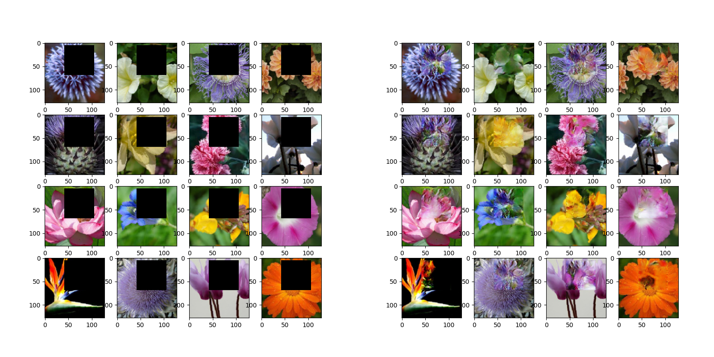
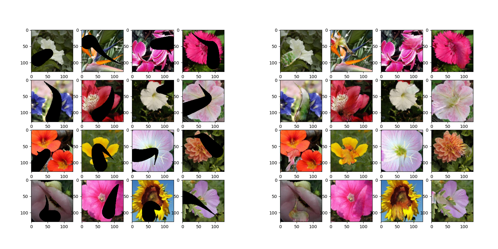

# Inpainting
A generative adversarial network that can repaint parts of images. If you want to learn about how this works checkout my youtube video on the topic. I explain in detail how the algorithm works, and ways in which you can develop and further improve the model if you wish to achieve state of the art results.

## Dataset

The images of flowers that were used to train this model can be downloaded from [here](https://drive.google.com/file/d/1YefFoLEGwUGDdGyw7fBpWxfcKFW9-kEj/view?usp=sharing)
The bezier curves that are used as strokes can be downloaded from [here](https://drive.google.com/file/d/1t3WIdF_0p7errAx7eOQPzurIagEzJkO5/view?usp=sharing) downloaded as well.

## Testing
There are 2 pretrained models saved under the models folder. If you wish to test these models, make sure you are in the root directory of the project and run `python patch_painting/test.py` to test the patch painting model or `python stroke_painting/test.py` to test the stroke painting model. Make sure you have `strokes.npy` downloaded for this.

## Training
To train the model, make sure you have the Dataset and the `strokes.npy` downloaded. You also have to create a folder in the root directory of the project called `progress`. Making sure you are inside the root directory of the project, run `python patch_painting/train.py` to train the patch painting model, or `python stroke_painting.py` to train the stroke painting model.

## Preview

